# Database Schema & ER Diagram

> PostgreSQL 17 -- source of truth for the Rule Repository.
> 35+ tables across 24 Alembic migrations (001-026, skipping 020).

---

## ER Diagram (Mermaid)

```mermaid
erDiagram
    %% ============================================================
    %% CORE DOMAIN
    %% ============================================================

    rules {
        uuid id PK
        text statement
        modality_enum modality
        severity_enum severity
        rule_status_enum status
        jsonb source_refs
        jsonb scope
        jsonb tags
        jsonb preconditions
        jsonb exceptions
        jsonb governance
        jsonb effective_period
        text rationale
        text context
        jsonb following_examples
        jsonb violation_examples
        float8_array embedding
        float8 clarity_score
        timestamptz created_at
        timestamptz updated_at
    }

    rule_revisions {
        uuid id PK
        uuid rule_id FK
        int revision_number
        text statement
        varchar modality
        varchar severity
        varchar status
        jsonb scope
        jsonb tags
        text rationale
        varchar changed_by
        text change_note
        timestamptz created_at
    }

    rule_relationships {
        uuid id PK
        uuid source_id FK
        uuid target_id FK
        relationship_type_enum relationship_type
        varchar created_by
        timestamptz created_at
    }

    %% ============================================================
    %% AUDIT & SECURITY
    %% ============================================================

    audit_log {
        uuid id PK
        timestamptz timestamp
        varchar action
        varchar actor
        varchar resource_type
        varchar resource_id
        jsonb details
        varchar previous_hash
        varchar entry_hash UK
    }

    api_keys {
        uuid id PK
        varchar key_hash UK
        varchar user_id
        role_enum role
        jsonb scopes
        boolean active
        timestamptz created_at
    }

    %% ============================================================
    %% DOCUMENT EXTRACTION
    %% ============================================================

    documents {
        uuid id PK
        varchar filename
        varchar mime_type
        int size_bytes
        varchar storage_path
        timestamptz uploaded_at
        varchar uploaded_by
    }

    extractions {
        uuid id PK
        uuid document_id FK
        jsonb candidates
        varchar model_id
        varchar status
        timestamptz extracted_at
    }

    %% ============================================================
    %% DISCOVERY
    %% ============================================================

    discovery_scans {
        uuid id PK
        varchar status
        jsonb sources
        varchar repository
        int candidates_found
        timestamptz created_at
        timestamptz completed_at
    }

    discovery_candidates {
        uuid id PK
        uuid scan_id FK
        text statement
        varchar modality
        varchar severity
        varchar_array scope
        varchar_array tags
        text rationale
        varchar source_type
        text source_evidence
        float8 confidence
        varchar status
        uuid created_rule_id FK
        timestamptz created_at
    }

    %% ============================================================
    %% FEEDBACK LOOP
    %% ============================================================

    corrections {
        uuid id PK
        text original_diff
        text corrected_diff
        varchar_array file_paths
        varchar repository
        int pr_number
        uuid_array evaluation_ids
        varchar analysis_type
        uuid_array matched_rule_ids
        text candidate_statement
        varchar candidate_modality
        varchar candidate_severity
        float8 confidence
        varchar status
        uuid created_rule_id FK
        timestamptz created_at
        timestamptz analyzed_at
    }

    %% ============================================================
    %% FEDERATION
    %% ============================================================

    rule_federations {
        uuid id PK
        varchar name
        varchar level
        uuid parent_id FK
        text description
        varchar_array default_scope
        timestamptz created_at
    }

    rule_federation_memberships {
        uuid id PK
        uuid rule_id FK
        uuid federation_id FK
        uuid override_parent_rule_id FK
        timestamptz created_at
    }

    %% ============================================================
    %% INTELLIGENCE & OBSERVABILITY
    %% ============================================================

    rule_health_scores {
        uuid id PK
        uuid rule_id FK
        float8 overall_score
        float8 completeness
        float8 clarity
        float8 test_coverage
        float8 freshness
        float8 activity
        float8 owner_engagement
        jsonb issues
        timestamptz computed_at
    }

    rule_recommendations {
        uuid id PK
        uuid rule_id FK
        varchar type
        varchar title
        text description
        text suggested_change
        uuid_array related_rule_ids
        varchar priority
        varchar status
        text dismissed_reason
        timestamptz created_at
        timestamptz resolved_at
    }

    drift_alerts {
        uuid id PK
        uuid rule_id FK
        varchar alert_type
        text description
        jsonb evidence
        varchar severity
        varchar status
        timestamptz created_at
        timestamptz resolved_at
    }

    alerts {
        uuid id PK
        varchar alert_type
        varchar severity
        varchar title
        text description
        uuid rule_id FK
        varchar status
        timestamptz created_at
        timestamptz resolved_at
    }

    %% ============================================================
    %% GATEWAY (ENFORCEMENT)
    %% ============================================================

    enforcement_policies {
        uuid id PK
        varchar name
        text description
        varchar event_source
        varchar event_type_pattern
        varchar rule_scope
        varchar_array rule_modality_filter
        varchar rule_severity_min
        varchar evaluation_mode
        text context_extraction_prompt
        jsonb response_actions
        varchar on_deny
        boolean enabled
        timestamptz created_at
        timestamptz updated_at
    }

    gateway_evaluations {
        uuid id PK
        uuid policy_id FK
        varchar event_source
        varchar event_type
        jsonb event_payload
        jsonb normalized_context
        varchar verdict
        uuid_array rule_ids_evaluated
        jsonb violations
        jsonb actions_taken
        int latency_ms
        timestamptz created_at
    }

    %% ============================================================
    %% PLAYGROUND & TESTING
    %% ============================================================

    rule_test_cases {
        uuid id PK
        uuid rule_id FK
        varchar name
        text sample_input
        varchar input_type
        varchar expected_verdict
        varchar last_result
        timestamptz last_run_at
        boolean passing
        timestamptz created_at
    }

    %% ============================================================
    %% SNAPSHOTS & DEPLOYMENT
    %% ============================================================

    rule_set_snapshots {
        uuid id PK
        varchar name
        text description
        varchar_array scope_filter
        jsonb rule_snapshot
        int rule_count
        varchar created_by
        timestamptz created_at
    }

    rule_set_deployments {
        uuid id PK
        uuid snapshot_id FK
        varchar environment
        boolean active
        varchar deployed_by
        timestamptz deployed_at
        timestamptz rolled_back_at
    }

    %% ============================================================
    %% LLM CACHE
    %% ============================================================

    llm_cache {
        uuid id PK
        varchar cache_key UK
        varchar model_id
        varchar prompt_version
        varchar inputs_hash
        jsonb response
        int latency_ms
        timestamptz created_at
    }

    %% ============================================================
    %% RELATIONSHIPS (FK lines)
    %% ============================================================

    rules ||--o{ rule_revisions : "has revisions"
    rules ||--o{ rule_relationships : "source_id"
    rules ||--o{ rule_relationships : "target_id"
    rules ||--o{ rule_test_cases : "has test cases"
    rules ||--o{ rule_health_scores : "has scores"
    rules ||--o{ rule_recommendations : "has recommendations"
    rules ||--o{ drift_alerts : "has drift alerts"
    rules ||--o{ alerts : "has alerts"
    rules ||--o{ rule_federation_memberships : "member of"
    rules ||--o{ discovery_candidates : "created from"
    rules ||--o{ corrections : "created from"

    documents ||--o{ extractions : "has extractions"

    discovery_scans ||--o{ discovery_candidates : "produces"

    enforcement_policies ||--o{ gateway_evaluations : "triggers"

    rule_federations ||--o{ rule_federation_memberships : "contains"
    rule_federations ||--o{ rule_federations : "parent_id (self-ref tree)"

    rule_set_snapshots ||--o{ rule_set_deployments : "deployed as"
```



---

## Table Groups

### Core Domain (3 tables)

| Table | Purpose | Key Relationships |
|---|---|---|
| **rules** | Central entity — stores natural-language rule statements with metadata | Referenced by 12 other tables |
| **rule_revisions** | Immutable snapshots of rule state at each change | `rule_id → rules.id` |
| **rule_relationships** | Directed edges: REFINES, OVERRIDES, CONFLICTS_WITH, DEPENDS_ON, DERIVES_FROM, SUCCEEDS | `source_id → rules.id`, `target_id → rules.id` |

### Audit & Security (2 tables)

| Table | Purpose | Key Relationships |
|---|---|---|
| **audit_log** | Append-only, hash-chained log of all actions. Trigger prevents UPDATE/DELETE. | Standalone (no FKs) |
| **api_keys** | API authentication tokens with role-based access | Standalone |

### Document Extraction (2 tables)

| Table | Purpose | Key Relationships |
|---|---|---|
| **documents** | Uploaded files (PDF, text, markdown) | Referenced by extractions |
| **extractions** | Gemini extraction results (candidate rules as JSONB array) | `document_id → documents.id` |

### Discovery (2 tables)

| Table | Purpose | Key Relationships |
|---|---|---|
| **discovery_scans** | Scan job metadata (status, sources analyzed) | Referenced by candidates |
| **discovery_candidates** | Auto-discovered rule candidates awaiting review | `scan_id → discovery_scans.id`, `created_rule_id → rules.id` |

### Feedback Loop (1 table)

| Table | Purpose | Key Relationships |
|---|---|---|
| **corrections** | Human corrections of AI-generated code, analyzed for rule gaps | `created_rule_id → rules.id` |

### Federation (2 tables)

| Table | Purpose | Key Relationships |
|---|---|---|
| **rule_federations** | Hierarchical nodes (organization → team → project) | `parent_id → rule_federations.id` (self-referential tree) |
| **rule_federation_memberships** | Links rules to federation levels with optional override | `rule_id → rules.id`, `federation_id → rule_federations.id`, `override_parent_rule_id → rules.id` |

### Intelligence & Observability (4 tables)

| Table | Purpose | Key Relationships |
|---|---|---|
| **rule_health_scores** | Pre-computed health scores (6 dimensions) | `rule_id → rules.id` |
| **rule_recommendations** | Automated improvement suggestions | `rule_id → rules.id` |
| **drift_alerts** | Verdict drift detection alerts | `rule_id → rules.id` |
| **alerts** | General proactive alerts (dormant, high deny rate, health decline) | `rule_id → rules.id` (nullable) |

### Gateway / Enforcement (2 tables)

| Table | Purpose | Key Relationships |
|---|---|---|
| **enforcement_policies** | Webhook event matching rules + response config | Referenced by evaluations |
| **gateway_evaluations** | Results of webhook-triggered evaluations | `policy_id → enforcement_policies.id` |

### Playground & Testing (1 table)

| Table | Purpose | Key Relationships |
|---|---|---|
| **rule_test_cases** | Per-rule test cases (sample input + expected verdict) | `rule_id → rules.id` |

### Evaluation Analytics (1 table)

| Table | Purpose | Key Relationships |
|---|---|---|
| **evaluations** | Per-rule evaluation results for analytics (verdict, confidence, latency, model, cached) | `rule_id → rules.id`, `project_id → projects.id` |

### Snapshots & Deployment (2 tables)

| Table | Purpose | Key Relationships |
|---|---|---|
| **rule_set_snapshots** | Immutable frozen copies of rules at a point in time | Referenced by deployments |
| **rule_set_deployments** | Tracks which snapshot is active per environment | `snapshot_id → rule_set_snapshots.id` |

### LLM Cache (1 table)

| Table | Purpose | Key Relationships |
|---|---|---|
| **llm_cache** | Cached Gemini responses keyed by hash(inputs+model+prompt) | Standalone |

### Governance Proposals (3 tables)

| Table | Purpose | Key Relationships |
|---|---|---|
| **proposals** | Governance proposals for rule changes (create, modify, retire) with voting lifecycle | `rule_id → rules.id`, `project_id → projects.id` |
| **proposal_comments** | Discussion comments on governance proposals | `proposal_id → proposals.id` |
| **notifications** | User notifications for proposal events and governance actions | `proposal_id → proposals.id` |

Note: The `rules` table also has a `context` column added in migration 018 to support richer rule metadata.

### Agent Governance (4 tables)

| Table | Purpose | Key Relationships |
|---|---|---|
| **agent_profiles** | Registered agent identities with trust levels and compliance history | Standalone |
| **agent_exception_requests** | Agent requests for temporary rule exceptions | `rule_id → rules.id`, `agent_id → agent_profiles.id` |
| **agent_negotiations** | Agent-initiated negotiations to challenge or adjust rule verdicts | `rule_id → rules.id`, `agent_id → agent_profiles.id` |
| **governance_sessions** | Tracking of agent governance sessions for audit | `agent_id → agent_profiles.id` |


---

## Enum Types

| Enum | Values |
|---|---|
| `modality_enum` | MUST, MUST_NOT, SHOULD, MAY, INFO |
| `severity_enum` | LOW, MEDIUM, HIGH, CRITICAL |
| `rule_status_enum` | DRAFT, REVIEW, APPROVED, EFFECTIVE, SUPERSEDED, RETIRED |
| `relationship_type_enum` | REFINES, OVERRIDES, CONFLICTS_WITH, DEPENDS_ON, DERIVES_FROM, SUCCEEDS |
| `role_enum` | OWNER, APPROVER, READER |

---

## Key Design Decisions

1. **`rules` is the hub** — 12 tables reference it via foreign keys. It's the source of truth for the entire system.

2. **Audit log is immutable** — A PostgreSQL trigger (`prevent_audit_mutation`) prevents UPDATE and DELETE. Each entry stores a `previous_hash` creating a hash chain for tamper evidence.

3. **JSONB for complex nested data** — `scope`, `tags`, `governance`, `effective_period`, `source_refs` are stored as JSONB to avoid excessive normalization while remaining queryable.

4. **Federation is a self-referential tree** — `rule_federations.parent_id` references itself, enabling arbitrary org → team → project hierarchies.

5. **Snapshots are immutable** — `rule_set_snapshots.rule_snapshot` is a frozen JSONB dict that doesn't change even if the underlying rules are modified later.

6. **Soft deletes via status** — Rules are never physically deleted. They transition to `RETIRED` status. `ON DELETE CASCADE` is used for dependent tables so orphan cleanup happens automatically if a rule is force-deleted (admin-only).

---

## Inspecting the Live Schema

```bash
# List all tables
docker compose exec postgres psql -U rule -d ruledb -c "\dt"

# Show columns + constraints for a table
docker compose exec postgres psql -U rule -d ruledb -c "\d rules"

# Show all foreign keys
docker compose exec postgres psql -U rule -d ruledb -c "
SELECT tc.table_name, kcu.column_name, ccu.table_name AS references
FROM information_schema.table_constraints tc
JOIN information_schema.key_column_usage kcu ON tc.constraint_name = kcu.constraint_name
JOIN information_schema.constraint_column_usage ccu ON ccu.constraint_name = tc.constraint_name
WHERE tc.constraint_type = 'FOREIGN KEY' ORDER BY tc.table_name;
"
```
