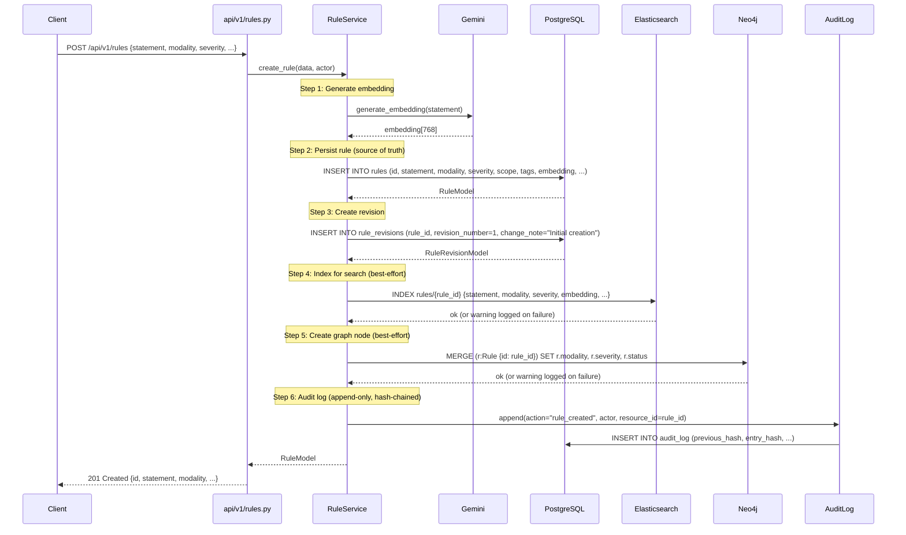
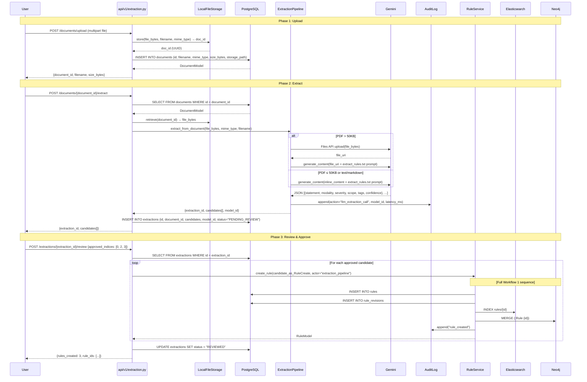
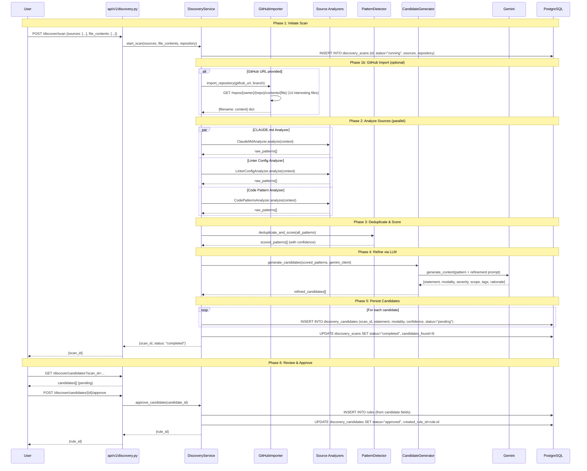
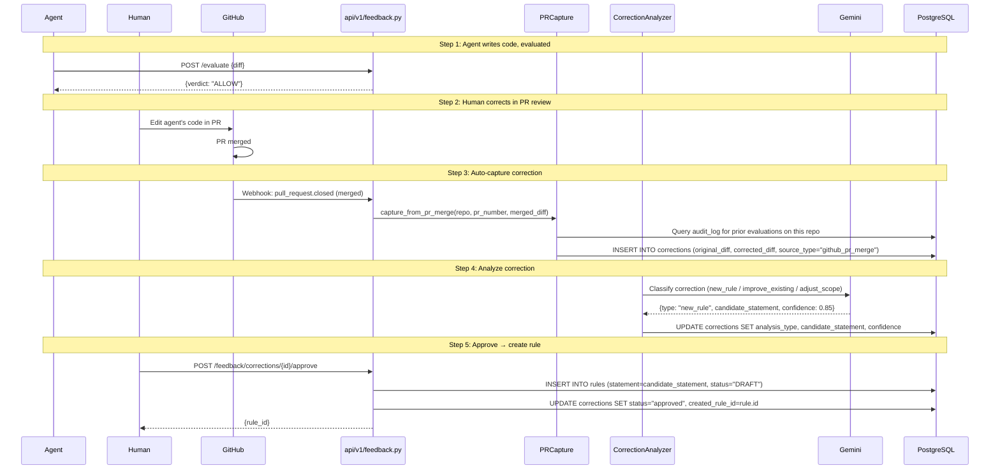

# Rule Registration Workflows

How rules enter the system — three primary paths, each with a sequence diagram showing interactions across all data stores.

**Source files:** `services/rule_service.py`, `api/v1/rules.py`, `api/v1/extraction.py`, `api/v1/discovery.py`, `api/v1/feedback.py`

---

## Workflow 1: Manual Rule Creation

A user creates a rule directly via the REST API or frontend form.



**Key properties:**
- PostgreSQL write MUST succeed — if it fails, the entire operation fails
- Elasticsearch and Neo4j writes are best-effort — failures are logged but don't roll back Postgres
- Embedding generation is optional — if Gemini is unavailable, the rule is created without an embedding
- The audit log append computes a SHA-256 hash chain linking to the previous entry

---

## Workflow 2: Document Extraction Pipeline

A user uploads a document (PDF, markdown, text), the system extracts candidate rules via Gemini, and a human reviews/approves them.



**Key properties:**
- Document upload and extraction are separate steps (user controls when to extract)
- Extraction uses Gemini with structured JSON output — no regex parsing
- Candidates are stored as JSONB in the `extractions` table until reviewed
- Approved candidates flow through the same `RuleService.create_rule()` as manual creation — full 3-store sync
- The LLM call itself is logged to the audit table (model_id, prompt version, latency)

---

## Workflow 3: Automatic Discovery Scan

The system scans repository artifacts (CLAUDE.md, linter configs, code patterns) and proposes candidate rules.



**Key properties:**
- Three analyzers run in parallel for speed
- GitHubImporter fetches files via GitHub Contents API (no cloning)
- Pattern detector deduplicates across sources — patterns found by multiple analyzers get higher confidence
- Gemini refines raw patterns into well-formed rule statements with structured output

---

## Workflow 4: Correction Feedback → Rule

When a human corrects agent-generated code, the correction can become a new rule.



**Key properties:**
- Corrections can be captured automatically (PR merge webhook) or manually (user submits diffs)
- The analyzer classifies corrections into three types to determine the right action
- Approved corrections create rules in DRAFT status (not immediately enforced)
- Rules from corrections are tagged `["auto-generated", "from-correction"]` for tracking

---

## Data Store Synchronization Matrix

| Workflow | PostgreSQL | Elasticsearch | Neo4j | Audit Log | Notes |
|---|---|---|---|---|---|
| **Manual create** | ✅ Insert | ✅ Index | ✅ Node | ✅ Entry | Full sync via `RuleService.create_rule()` |
| **Extraction review** | ✅ Insert | ✅ Index | ✅ Node | ✅ Entry | Uses `RuleService.create_rule()` |
| **Discovery approve** | ✅ Insert | ⚠️ Not indexed | ⚠️ No node | ⚠️ No entry | Direct PG insert — needs reconciler |
| **Feedback approve** | ✅ Insert | ⚠️ Not indexed | ⚠️ No node | ⚠️ No entry | Direct PG insert — needs reconciler |

**Recovery:** Run `scripts/reindex_elasticsearch.py` and `scripts/reconcile_graph.py` to sync derived stores from PostgreSQL.

---

## Rule Lifecycle After Registration

```
DRAFT ──────► REVIEW ──────► APPROVED ──────► EFFECTIVE ──────► RETIRED
  │              │                                │                  ▲
  └──────────────┴────────────────────────────────┴──────────────────┘
                         (can retire from any state)

Status transitions are validated in domain/rule.py — invalid jumps raise ValidationError.
RETIRED is terminal (rules are never deleted).
```

---

## Files Referenced

| File | Role |
|---|---|
| `api/v1/rules.py` | Manual rule creation endpoint |
| `services/rule_service.py` | Orchestrates writes to all 3 stores |
| `api/v1/extraction.py` | Document upload, extract, review endpoints |
| `services/extraction/pipeline.py` | Gemini-powered rule extraction |
| `api/v1/discovery.py` | Discovery scan, candidate approve endpoints |
| `services/discovery/service.py` | Scan orchestration, analyzer dispatch |
| `services/discovery/github_importer.py` | GitHub Contents API file fetcher |
| `api/v1/feedback.py` | Correction submission and approval |
| `services/feedback/pr_capture.py` | Auto-capture corrections from merged PRs |
| `services/feedback/correction_analyzer.py` | Classify corrections via Gemini |
| `adapters/postgres/rule_repo.py` | PostgreSQL CRUD operations |
| `adapters/elasticsearch/rule_index.py` | ES indexing and search |
| `adapters/neo4j/graph_repo.py` | Neo4j node and relationship operations |
| `adapters/postgres/audit_repo.py` | Append-only audit log with hash chain |
| `scripts/reindex_elasticsearch.py` | Rebuild ES index from Postgres |
| `scripts/reconcile_graph.py` | Rebuild Neo4j graph from Postgres |
